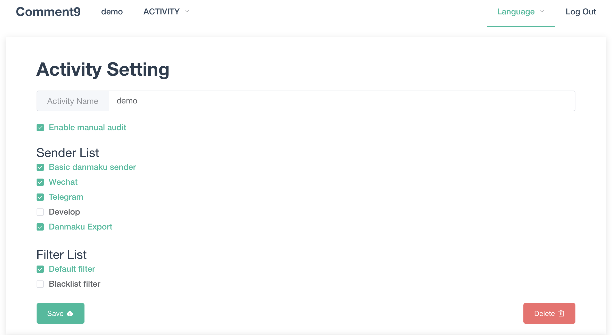

<h1 align="center">Comment9</h1>

> A simple & powerful danmaku framework.

<p align="center">
<a href="https://github.com/prnake/Comment9/blob/master/README.md" target="_blank" rel="noopener noreferrer">中文</a>
|
English
</p>


[](https://github.com/prnake/comment9/actions/workflows/docker-release.yml)

[](http://opensource.org/licenses/MIT)
[](https://app.fossa.com/projects/git%2Bgithub.com%2Fprnake%2FComment9?ref=badge_shield)

## Introduction

Comment9 is an open source, easy to use, and extensible real-time danmaku service framework.

## Feature

- Server
  - Support diversified and expandable advanced danmakus
  - The danmaku sending system can be accessed by web, WeChat, Telegram, API, etc.
  - Stable pushing of danmakus using Socket.IO
  - Support automatic and manual audit of danmakus
  - Easy to use web backend management system
  - Support multi-user and multiple activities
  - Independent permission control for publishing, subscribing and auditing
  - Support for exporting danmaku history data
  - Easily expandable danmaku sending system and danmaku filtering system
  - Multi-language support for Chinese, Japanese and English
- Web
  - Support diversified ways of displaying and sending danmakus such as danmaku wall, danmaku list and live broadcast
  - Advanced comment support based on CommentCoreLibrary
  - YouTube style danmaku list based on blivechat for OBS
- [DanmaQ](https://github.com/tuna/danmaQ)
  - Qt5 implementation of cross-platform desktop danmaku player
  - Full-screen danmaku top play layer with HiDPI screen and multi-monitor support
  - Quick subscription to Comment9 server with automatic reconnection
  - Support for colorful scrolling, top and bottom danmakus

## Demo

We deployed a demo using Comment9, providing [danmaku wall](https://comment.pka.moe/#/Wall/demo/screen), [danmaku list wall](https://comment.pka.moe/#/List/demo/screen), [danmaku stream player](https://comment.pka.moe/#/Player/demo/screen), [danmaku web page sender](https://comment.pka.moe/#/Sender/demo/user/userpass) and Telegram bot [@comment9_bot](https://t.me/comment9_bot) for testing, and you may need to send your own danmakus to see the effect.

You can also directly visit the [danmaku wall](https://comment.pka.moe/#/Wall/test), [danmaku list wall](https://comment.pka.moe/#/List/test) and [danmaku stream player](https://comment.pka.moe/#/Player/test) to see the effect when there are many danmakus.

Below is a screenshot of the web backend management system of Comment9



## Deployment

### Docker Compose Deployment

#### Install

Download [docker-compose.yml](https://github.com/prnake/Comment9/blob/master/docker-compose.yml)

```bash
wget https://raw.githubusercontent.com/prnake/Comment9/master/docker-compose.yml
```

This deployment method only requires changing the `HOST` field `https://comment.pka.moe` in the `environment` section of `docker-compose.yml` to the actual deployment domain, see [#Configuration](#Configuration) for more configuration items


```bash
url="actual deploy domain"
sed -i '' "s/https:\/\/comment.pka.moe/${url}/g" docker-compose.yml
```

Launch

```bash
docker-compose up -d
```

#### Update

Remove old containers

```bash
docker-compose down
```

Repull the latest image if you have downloaded the image before

```bash
docker pull prnake/comment9
```

Then repeat the installation steps

### Docker Deployment

#### Install

Modify the environment variables in the following command and run it. For an explanation of the configuration items, see [#Configuration](#Configuration).

```bash
docker run -it --name comment9 -p 3000:3000 \
  -e "HOST=" \
  -e "BASE_URL="  \
  -e "INVITE_CODE=" \
  -e "REDIS_HOST=" \
  -e "REDIS_PORT=" \
  -e "MONGO_HOST=" \
  -e "MONGO_DATABASE=" \
  prnake/comment9:latest
```

This deployment method requires additional configuration of MongoDB and Redis services, so please use Docker Compose deployment method or deploy external dependencies by yourself if needed.

### Manual Deployment

#### Prepare

It is recommended to install with `yarn` in an environment with Node.js version no less than 14, and if you don't have MongoDB and Redis services, you can use Docker to start them.

```bash
docker run -d --name mongo -p 27017:27017 mongo
docker run -d --name redis -p 6379:6379 redis
```

#### Install

Pull source code

```bash
git clone https://github.com/prnake/Comment9
cd Comment9
```

Create a new `.env` file in the project root directory and add environment variables in `NAME=VALUE` format on each line, e.g. fill in the deployment domain

```env
HOST="actual deploy domain"
```

If you use your own MongoDB and Redis services, you will need to configure them additionally, see [#Configuration](#Configuration)

Building the front end

```bash
yarn
yarn build
```

Launch

```bash
yarn start
```

Or use [PM2](https://pm2.keymetrics.io/docs/usage/quick-start/)

```bash
pm2 start
```

## Configuration

To configure Comment9 by setting environment variables, create a new `.env` file in the project root directory and add environment variables in `NAME=VALUE` format on each line

| environment    | default_value         | description                  |
| -------------- | --------------------- | ---------------------------- |
| PORT           | 3000                  | the port on which the web server is listening |
| HOST           | http://localhost:3000 | deploy domain                     |
| BASE_URL       |                       | deploy subpath, such as "/comment"  |
| INVITE_CODE    |                       | required at registration, used to limit registration |
| MONGO_USERNAME | null                  | mongodb configuration                 |
| MONGO_PASSWORD | null                  | mongodb configuration                 |
| MONGO_HOST     | 127.0.0.1             | mongodb configuration                 |
| MONGO_PORT     | 27017                 | mongodb configuration                 |
| MONGO_DATABASE | Comment9              | mongodb configuration                 |
| REDIS_HOST     |                       | redis configuration                   |
| REDIS_PORT     |                       | redis configuration                   |
| REDIS_PASSWORD |                       | redis configuration                   |
| SECRET         | Danmaku               | express session secret    |

You can also read the `config.js` file to see the configurable environment variables.

## Usage

### Use API to actively collect Bilibili live danmakus

Here we use [blivedm](https://github.com/xfgryujk/blivedm) to collect danmakus from Bilibili live stream, and send them to the Comment9 server via [python-socketio](https://python-socketio.readthedocs.io/ en/latest), see [example/bilibili](example/bilibili) folder for details.

### Presence Features & Bugs

- You can use the activity name in the url instead of the activity id for indexing, for example [#Demo](#Demo) uses this method
- The danmaku list can use [style generator](https://style.vtbs.moe) to generate custom styles used in OBS, visiting [blivechat](https://github.com/xfgryujk/blivechat) for details
- The audit screen is focused on the input box, the keyboard passes to the right and rejects to the left
- Each danmaku will only appear once in the audit, if there is an un-audited danmaku before refreshing the page, the danmaku will remain un-audited
- Deployment domain must be configured manually, e.g. messages sent to WeChat and Telegram need to have this field in the message
- Deploying with a reverse proxy may require additional configuration of websockets, or Socket.IO will fall back to HTTP long polling mode and cause modules like `python-socketio` unable to work
- ElementUI's i18n does not work properly

## Develop

Refer to [Develop](docs/develop.en.md)

## Thanks

### Contributors

[](https://github.com/prnake/Comment9/graphs/contributors)

### Core projects

- The project is developed using [Node.js](https://nodejs.org), [Vue2](https://vuejs.org) for the front-end, [Express](https://expressjs.com) and [Socket.IO](https://socket) for the back-end, and [MongoDB](https://www.mongodb.com) and [Redis](https://redis.io) for the database
- Use [CommentCoreLibrary](https://github.com/jabbany/CommentCoreLibrary) to design the danmaku format and implement advanced danmaku display on the web side
- Use [blivechat](https://github.com/xfgryujk/blivechat) to implement a YouTube style danmaku list that can be used for OBS
- Implement a card-style review interface using [vue-tinder](https://github.com/shanlh/vue-tinder)
- Use [blivedm](https://github.com/xfgryujk/blivedm) to collect danmakus from Bilibili live streams
- Refer to [RSSHub](https://github.com/DIYgod/RSSHub/) to improve the document and auto build process

## License

[](https://app.fossa.com/projects/git%2Bgithub.com%2Fprnake%2FComment9?ref=badge_large)