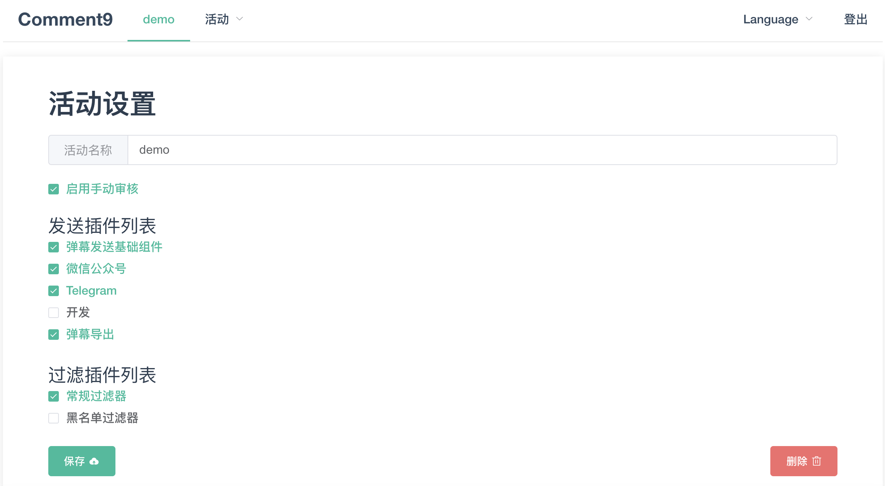

<h1 align="center">Comment9</h1>

> A simple & powerful danmaku framework.

<p align="center">
中文
|
<a href="https://github.com/prnake/Comment9/blob/master/README.en.md" target="_blank" rel="noopener noreferrer">English</a>
</p>


[](https://github.com/prnake/comment9/actions/workflows/docker-release.yml)

[](http://opensource.org/licenses/MIT)
[](https://app.fossa.com/projects/git%2Bgithub.com%2Fprnake%2FComment9?ref=badge_shield)

## 介绍

Comment9 是一个开源、简单易用、易于扩展的实时弹幕服务框架。

## 特性

- 弹幕服务器
  - 支持多样化、可拓展的高级弹幕
  - 弹幕发送系统能够使用网页、微信、Telegram、API等多种方式接入
  - 使用 Socket.IO 实现弹幕的稳定推送
  - 支持弹幕的自动和人工审核
  - 易用的 Web 后台管理系统
  - 支持独立的多用户与多个活动
  - 发布、订阅、审核等不同角色相互独立的权限控制系统
  - 支持导出弹幕历史数据
  - 易于拓展的弹幕发送系统和弹幕审核系统
  - 中日英多语言支持
- 弹幕网页端
  - 支持弹幕墙、弹幕列表、直播等多样化的弹幕展示与发送方式
  - 基于 CommentCoreLibrary 的高级弹幕支持
  - 基于 blivechat 的可用于 OBS 的 YouTube 风格弹幕列表
- 弹幕桌面端 danmaQ
  - Qt5 实现的跨平台桌面弹幕播放器
  - 支持高分屏与多显示器选择的全屏弹幕置顶播放层
  - 快捷订阅 Comment9 服务器，支持自动重连
  - 支持带色彩的滚动、置顶和底部弹幕

## Demo

我们使用 Comment9 部署了一个测试活动，提供[弹幕墙](https://comment.pka.moe/#/wall/demo/screen)、[弹幕列表墙](https://comment.pka.moe/#/list/demo/screen)、[弹幕视频播放器](https://comment.pka.moe/#/player/demo/screen)、[弹幕网页发送器](https://comment.pka.moe/#/wall/demo/user/userpass)与 Telegram 机器人 [@comment9_bot](https://t.me/comment9_bot) 进行测试，可能需要自行发送弹幕来查看效果。

也可以直接访问[弹幕墙](https://comment.pka.moe/#/wall/test)、[弹幕列表墙](https://comment.pka.moe/#/list/test)和[弹幕视频播放器](https://comment.pka.moe/#/player/test)的测试页面查看弹幕较多时的效果。

下面是 Comment9 的 Web 后台管理系统截图



## 部署

### Docker Compose 部署

#### 安装

下载 [docker-compose.yml](https://github.com/prnake/Comment9/blob/master/docker-compose.yml)

```bash
wget https://github.com/prnake/Comment9/blob/master/docker-compose.yml
```

该部署方式只需要将 `docker-compose.yml` 中 `environment` 部分的 `HOST` 字段 `https://comment.pka.moe` 修改为实际的部署域名，更多配置项请看 [#配置](#配置)。

```bash
url="实际部署域名"
sed -i '' "s/https:\/\/comment.pka.moe/${url}/g" docker-compose.yml
```

启动

```bash
docker-compose up -d
```

#### 更新

删除旧容器

```bash
docker-compose down
```

如果之前已经下载 / 使用过镜像，下方命令可以帮助你获取最新版本

```bash
docker pull prnake/comment9
```

然后重复安装步骤

### Docker 部署

#### 安装

修改下方命令中的环境变量并运行，对配置项的解释请看 [#配置](#配置)

```bash
docker run -it --name comment9 -p 3000:3000 \
  -e "HOST=" \
  -e "BASE_URL="  \
  -e "INVITE_CODE=" \
  -e "REDIS_HOST=" \
  -e "REDIS_PORT=" \
  -e "MONGO_HOST=" \
  -e "MONGO_DATABASE=" \
  prnake/comment9:latest
```

该部署方式需要额外配置 MongoDB 与 Redis 服务，如有需要请改用 Docker Compose 部署方式或自行部署外部依赖。

### 手动部署

#### 准备

建议在 Node.js 版本不低于 12 的环境下使用 `yarn` 安装，如果没有 MongoDB 与 Redis 服务，可以使用 Docker 启动。

```bash
docker run -d --name mongo -p 27017:27017 mongo
docker run -d --name redis -p 6379:6379 redis
```

#### 安装

拉取源码

```bash
git clone https://github.com/prnake/Comment9
cd Comment9
```

在项目根目录新建一个 `.env` 文件，每行以 `NAME=VALUE` 格式添加环境变量，例如填入部署域名

```env
HOST="实际部署域名"
```

如果使用了自己的 MongoDB 与 Redis 服务则还需要额外配置，具体配置项请看 [#配置](#配置)

构建前端

```bash
yarn
yarn build
```

启动

```bash
yarn start
```

或使用 [PM2](https://pm2.keymetrics.io/docs/usage/quick-start/) 启动

```bash
pm2 start
```

## 配置

通过设置环境变量来配置 Comment9，可以在项目根目录新建一个 `.env` 文件，每行以 `NAME=VALUE` 格式添加环境变量

| 环境变量       | 默认值                | 说明                         |
| -------------- | --------------------- | ---------------------------- |
| PORT           | 3000                  | 运行端口                     |
| HOST           | http://localhost:3000 | 部署域名                     |
| BASE_URL       |                       | 部署子路径，例如 "/comment"  |
| INVITE_CODE    |                       | 注册时要求输入，用于限制注册 |
| MONGO_USERNAME | null                  | mongodb 配置                 |
| MONGO_PASSWORD | null                  | mongodb 配置                 |
| MONGO_HOST     | 127.0.0.1             | mongodb 配置                 |
| MONGO_PORT     | 27017                 | mongodb 配置                 |
| MONGO_DATABASE | Comment9              | mongodb 配置                 |
| REDIS_HOST     |                       | redis 配置                   |
| REDIS_PORT     |                       | redis 配置                   |
| REDIS_PASSWORD |                       | redis 配置                   |
| SECRET         | Danmaku               | express session 密钥         |

还可以阅读 `config.js` 文件查看可配置的环境变量

## 使用

### 使用 API 主动接入B站直播弹幕

这里使用 [bililive_dm](https://github.com/copyliu/bililive_dm) 实现对B站直播弹幕的收集，通过 [python-socketio](https://python-socketio.readthedocs.io/en/latest) 发送到 Comment9 服务器，详情查看 [example/bilibili](example/bilibili) 文件夹。

### 存在的 Features & Bugs

- 在 url 中可以使用活动名称代替活动 id 进行索引，例如 [#Demo](#Demo) 中就使用了这个方法
- 弹幕列表可以使用 [样式生成器](https://style.vtbs.moe) 生成 OBS 中使用的自定义样式，也可访问 [bililive_dm](https://github.com/copyliu/bililive_dm) 查看详情
- 审核界面聚焦在输入框，键盘向右通过，向左拒绝
- 每条弹幕在审核处只会出现一次，如果刷新网页前有未审核的弹幕，该弹幕将保持未审核状态
- 必须手动配置部署域名，例如向微信和 Telegram 发送的消息中需要带有这一字段
- ElementUI 的 i18n 不能正常工作

## 开发

见 [开发](docs/develop.md)

## 致谢

### 开发者

[](https://github.com/prnake/Comment9/graphs/contributors)

### 核心项目

- 项目使用 [Node.js](https://nodejs.org) 开发，前端使用 [Vue2](https://vuejs.org)，后端使用 [Express](https://expressjs.com) 和 [Socket.IO](https://socket.io)，数据库使用 [MongoDB](https://www.mongodb.com) 和 [Redis](https://redis.io)
- 使用 [CommentCoreLibrary](https://github.com/jabbany/CommentCoreLibrary) 规范设计弹幕格式，实现网页端的高级弹幕显示
- 使用 [blivechat](https://github.com/xfgryujk/blivechat) 实现可用于 OBS 的 YouTube 风格弹幕列表
- 参考 [vue-tinder](https://github.com/shanlh/vue-tinder) 实现卡片样式的审核界面
- 使用 [bililive_dm](https://github.com/copyliu/bililive_dm) 实现对B站直播弹幕的收集
- 参考 [RSSHub](https://github.com/DIYgod/RSSHub/) 完善文档与自动化流程

## 许可证

[](https://app.fossa.com/projects/git%2Bgithub.com%2Fprnake%2FComment9?ref=badge_large)